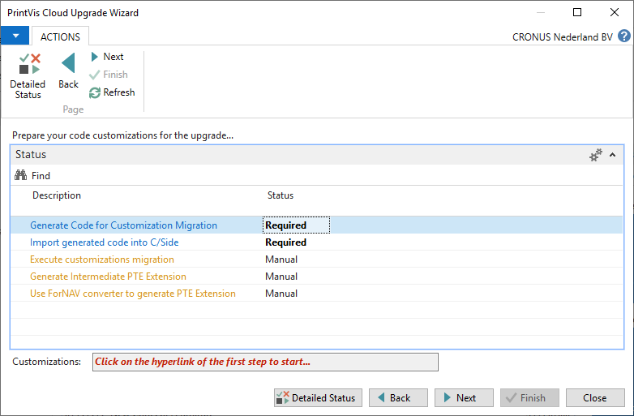
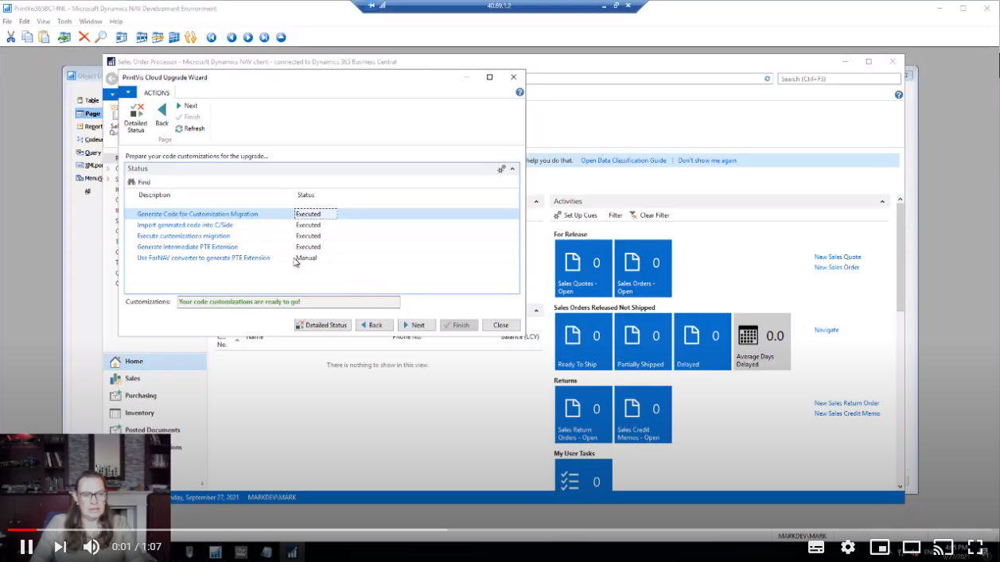
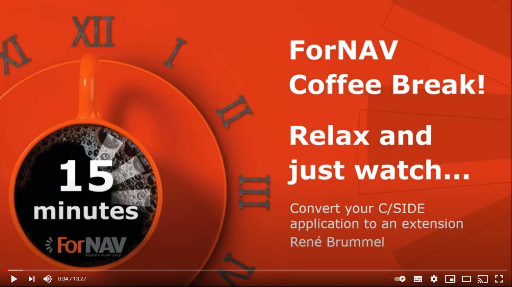

# Part 1 - Preparations in C/Side

The preparation for the upgrade is guided by a wizard, documenation and video's. We've spit the steps into two categories; Customizations and PrintVis.

The Customizations step is optional, but if the system is customized it's mandatory to handle this step before continuing with the PrintVis Step.

## Importing the Upgrade Toolkit & Starting the Wizard

This part starts by importing the .fob file in your C/Side system and starting the wizard page. You can start the Upgrade Wizard directly from C/Side by executing page 104000 or you can use the Run Generic Object from the Role Tailored Client and start page 104000 from there.

```
NOTE - Running the Upgrade Toolkit requires a Partner License to be activated on the Service Tier
```

The Wizard has automatically scans the database for any data customizations. If you have customized PrintVis it is mandatory to process these changes before preparing PrintVis tables. If you skip this step there is a chance that you remove data that cannot be recovered without restoring a backup.
As part of the upgrade project we will create the Per Tenant Extension skeleton that will hold your customizations in the Cloud system.

[](https://vimeo.com/623385800/88ea0d2f60 "Import Upgrade Toolkit Click to Watch!")
<br>
```
NOTE - The tool does not detect any changes done to the PrintVis schema such as datatype changes, added option values or changes in length of text and code fields.
```

## Steps for Customizations

The wizard has 5 guided steps for preparing your customizations to the cloud. If your database has customizations the first 4 steps are mandatory. The last step is a link to create the Per Tenant Extension using the ForNAV Converter. We think this is the fastest way to prepare this solution.



### Step 1 - Generate Code for Customizations Migration

In this step we will generate C/AL Objects that will act as intermediate tables to contain your customized data.

If you click on the link a file will be generated that you can import into C/Side.

### Step 2 - Import Objects into C/Side

The file we have imported in Step 1 needs to be imported into C/Side and the objects should be compiled.

[](https://vimeo.com/623412738/63d771a92c "Import Upgrade Toolkit Click to Watch!")

### Step 3 - Execute Customizations Migration

Now that we have the intermediate tables in our system we can copy the data from the customized tables into the intermediate tables. These tables will contain the data when the upgrade is executed.

You can see which tables are modified and if the data is prepared by clicking on "Detailed Status" and then filtering on "Customization".

```
NOTE - You cannot execute this step if you did not follow step 1 and step 2
```

### Step 4 - Generate Intermediate PTE Extension

In order to move the data to Business Central we need the same datastructure in AL. This step will create an AL file with the definitions. We need this file in part two of the upgrade toolkit so place it where you can easily find it later, like on the desktop.

### Step 5 - Use ForNAV to generate the Per Tenant Extension

To work with the customizations in Business Central you will need to create a Per Tenant Extension. This will require a minimum of the table extensions and the page extensions with your modifications to PrintVis. On top of that you will also need your own tables, pages, reports and codeunits as well as event subscribers where you code customized PrintVis.

ForNAV can generate a skeleton project in AL without the use of PowerShell, Delta files and the finsql.exe in the MS-Dos prompt.

[](https://www.youtube.com/watch?v=YHAqYSp4rKM "ForNAV Converter Click to Watch!")

## PrintVis Data Preparation

The preparation of PrintVis to move to the cloud consists of two important parts of which the first part is similar to the code customizations. We will copy the data that PrintVis adds to Microsoft Dynamics NAV base objects to intermediate tables.

The second part is to import a .fob file that will rename fields in order to match the schema in our AppSource solution.

```
NOTE - After importing this .fob file your customizations will be destroyed and PrintVis may no longer work as expected. Don't use the system anymore after completing this step!
```

### Step 1 - Import Upgrade Toolkit

This step was already completed when you imported the .fob file at the start of this document. If you see this light up in green, you are ready to proceed with step 2. If this shows red, you need to verify if you made any mistakes in the preparation of the customizations and restart the upgrade.

### Step 2 - Execute Conversion Tool

In this step we will make sure the customized data can be converted to Business Central by making a copy into interim tables. You can check the progress and status by clicking on "Detailed Status"

### Step 3 - Fixing Errors

If anything has gone wrong in Step 2, this step will light red and indicate that you need to check "Detailed Status".

An example of what might cause errors are datatype changes done to PrintVis fields added to Microsoft Dynamics NAV objects such as changing a boolean into an integer.

### Step 4 - Import Renamed Fields

The last step is to import the .fob file with the fields that we renamed. After the import you need to make sure to synchronize the SQL Schema.

```
NOTE - If you have customized PrintVis you will have to use the Force Schema Synchronization because importing the .fob file will remove your customizations.
```

# Congratulations! You have prepared the old system to be migrated to Business Central!