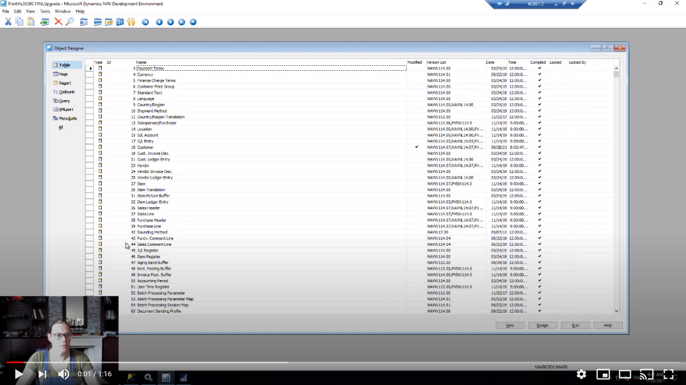

# Part 1 - Preparations in C/Side

The preparation for the upgrade is guided by a wizard, documenation and video's. We've spit the steps into two categories; Customizations and PrintVis.

The Customizations step is optional, but if the system is customized it's mandatory to handle this step before continuing with the PrintVis Step.

## Importing the Upgrade Toolkit & Starting the Wizard

This part starts by importing the .fob file in your C/Side system and starting the wizard page. You can start the Upgrade Wizard directly from C/Side by executing page 104000 or you can use the Run Generic Object from the Role Tailored Client and start page 104000 from there.

```
NOTE - Running the Upgrade Toolkit requires a Partner License to be activated on the Service Tier
```

The Wizard has automatically scans the database for any data customizations. If you have customized PrintVis it is mandatory to process these changes before preparing PrintVis tables. If you skip this step there is a chance that you remove data that cannot be recovered without restoring a backup.
As part of the upgrade project we will create the Per Tenant Extension skeleton that will hold your customizations in the Cloud system.

[](https://www.youtube.com/watch?v=XRGSMVC54TM "Import Upgrade Toolkit Click to Watch!")

<br>
```
NOTE - The tool does not detect any changes done to the PrintVis schema such as datatype changes, added option values or changes in length of text and code fields.
```

## Steps for Customizations

The wizard
Prepare PrintVis data