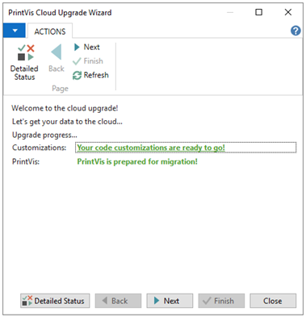
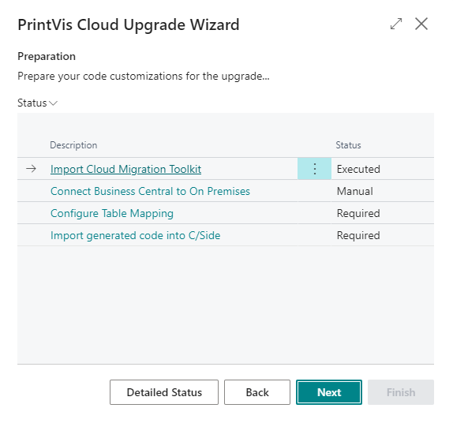
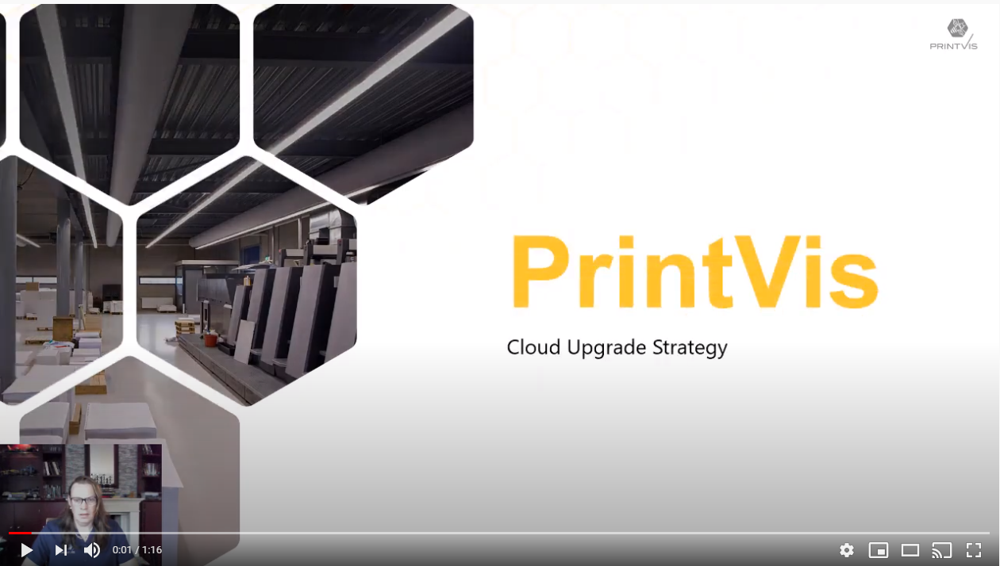

# PrintVis Cloud Upgrade Toolkit

This repository contains objects and materials to help you upgrade customers from Microsoft Dynamics 365 Business Central 14 (Running with C/Side) to the latest current version.

The Toolkit has two mandatory parts do execute the data conversion and a few optional steps to help you generate the Per Tenant Extensions and migrate the system "back" to On Premises.

## Goal

We believe that the steps provided in this toolkit are the easiest and fastest way to migrate a PrintVis system to the latest current version. Based on the feedback from our previous toolkit we decided to avoid any scripting with PowerShell, generate as much code as possible for you and provide templates for the customizations you have probably done to the old system.
The tool is leveraging the Azure Data Factory that is hosted by Microsoft and runs only in the cloud. If you want your customer to run On Premises or hosted in their own, private, cloud we recommend still using this toolkit and at the end, downloading the .bacpac and restore this in the desired environment.

## [Step 1 - C/Side](https://github.com/printvis/PrintVis.CloudUpgrade/blob/main/Part%201/README.md)

Everything is perpared in C/Side and in the old system no extensions are required nore do we run any PowerShell scripts. We tried to make this as simple as possible.
The mandatory and optional actions required for this step are guided by a wizard and the system will prevent you from starting the data migration before all mandatory steps are finished.

## [Step 2 - Visual Studio Code & Business Central Online](https://github.com/printvis/PrintVis.CloudUpgrade/blob/main/Part%202/README.md)

The actual data migration is triggered from the Business Central Online tenant at the customer. This part is documented by Microsoft, but to make it easier, we combined the documentation from Microsoft in one place to get you started as fast as possible.
We have also created a wizard to help in this process and make sure you don't forget anything.

## Optional Steps

As part of the upgrade there are two optional steps that we guide you with.

The first step is to create the Per Tenant Extension that contains the customizations that you have done in the current system. We advise to use the free of use converter of ForNAV. We have added an example of how to use this in combination with PrintVis and define a to-do list for managing your migration.

A second step might be to run Business Central On Premises or in a private cloud. If this is required by one of your customers we still recommend following step 1 and step 2. At the end of step 2 you can download the .pacpak file from the Admin Portal and mount this on a multi tenant environment.

